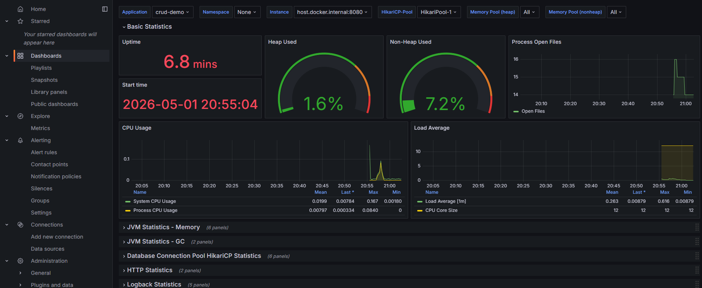
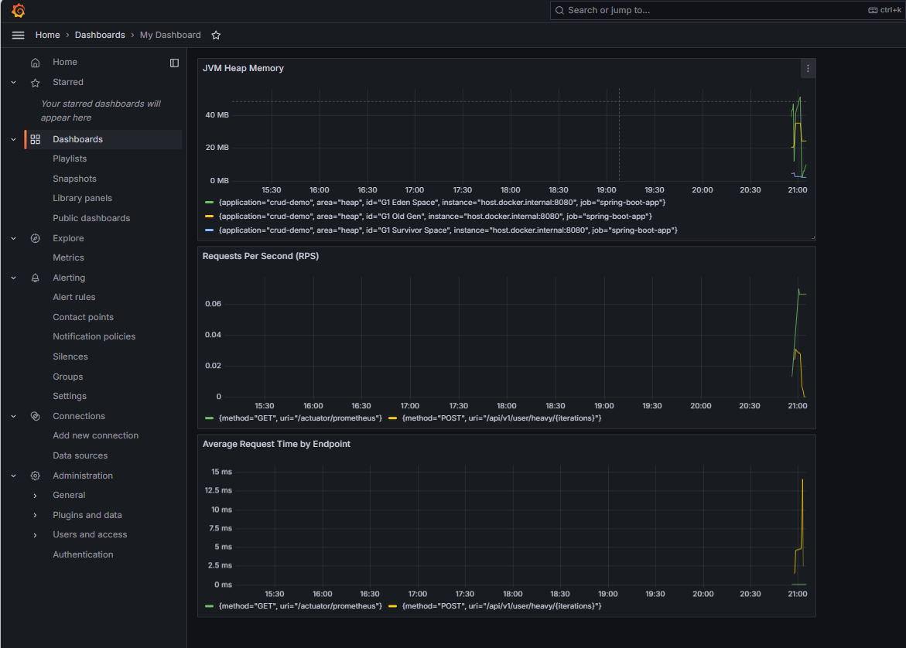

## Анализ дампов потоков

### Топ 3 потока по нагрузке

| Название потока | Время жизни (elapsed ms) | Время работы (cpu ms) | Процент нагрузки |
|----------------|-------------------------|----------------------|------------------|
| http-nio-8080-exec-7 | 222820 | 33125.00 | 14.87% |
| UserService-highLoadMethod | 222750 | 3093.75 | 1.39% |
| C2 CompilerThread0 | 222820 | 3078.12 | 1.38% |

## Мониторинг с Prometheus и Grafana

### Скриншоты дашбордов

#### Стандартный из лекции

#### Собственный дашборд для CRUD сервиса

### Запросы PromQL и описание панелей

| Панель | PromQL запрос | Описание метрики |
|--------|---------------|------------------|
| **JVM Heap Memory** | `jvm_memory_used_bytes{area="heap"}` | Показывает использование heap памяти JVM в реальном времени. Метрика берется из Micrometer и отображает объем памяти, занятый объектами в куче. |
| **Requests Per Second (RPS)** | `rate(http_server_requests_seconds_count[5m])` | Отображает количество HTTP запросов в секунду за последние 5 минут. Позволяет оценить нагрузку на сервер и выявить пиковые значения. |
| **Average Request Time by Endpoint** | `sum by(uri, method) (rate(http_server_requests_seconds_sum[5m])) / sum by(uri, method) (rate(http_server_requests_seconds_count[5m]))` | Показывает среднее время выполнения запросов для каждого эндпоинта в секундах. Группировка по HTTP методу (GET, POST, PATCH) и URI позволяет выявить медленные операции. |
